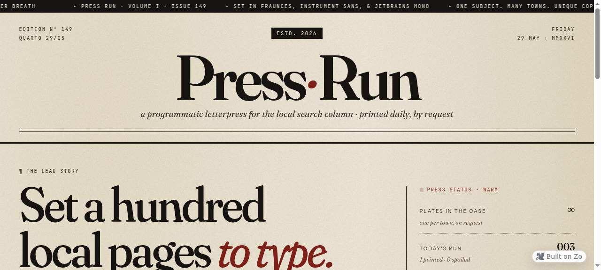
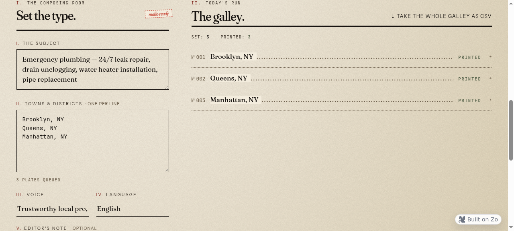
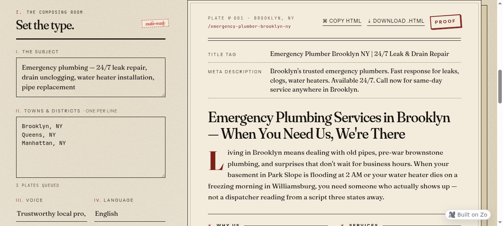

<div align="center">

# Press·Run

**Programmatic SEO Generator with Letterpress Aesthetics**

[](https://s1.zo.space)
[](https://opensource.org/licenses/MIT)


*A tool that generates unique local landing pages at scale, styled after vintage letterpress printing*

</div>

---

## Overview

Press·Run is a programmatic SEO tool that generates high-quality, location-specific landing pages. Describe your service once, provide a list of locations, and get unique pages with:

- **Real local context** — Mentions actual neighborhoods, landmarks, and local references
- **SEO-optimized structure** — Title, meta description, H1, FAQ schema-ready content
- **Unique copy every time** — No templated content, each page is genuinely different

The UI is designed as a tribute to letterpress printing — because what this tool does is literally "printing pages," the interface embraces that metaphor with vintage typography, paper textures, and a press-inspired workflow.

---

## Screenshots

### Hero & Input


The masthead features a running ticker, edition number, and the signature Press·Run logo with oxblood accent.

### Generation in Progress



Watch the press run in real-time with progress indicators and status messages.

### Table of Contents



A classic ToC layout with leader dots connecting locations to their pages.

### Proof View



Review the generated page with proper typographic hierarchy — ready to export or refine.

---

## Features

- **Multi-location generation** — Process dozens of locations in one run
- **Language support** — Works in English, Russian, and other languages
- **Customizable tone** — Professional, friendly, technical, or warm
- **Export options** — Copy individual pages or download all as CSV
- **Responsive design** — Works on desktop and tablet

---

## Tech Stack

| Layer | Technology |
|-------|------------|
| Frontend | React 18, TypeScript |
| Styling | Tailwind CSS, Custom CSS |
| Typography | Fraunces (display), Instrument Sans (UI), JetBrains Mono (code) |
| Backend | Hono (API routes) |
| Runtime | Bun |
| AI | Anthropic Claude (via Zo API) |

---

## Project Structure

```
press-run/
├── src/
│   └── routes/
│       ├── index.tsx              # Main React component
│       └── api/
│           └── generate-page.ts   # API endpoint
├── docs/
│   └── screenshots/               # UI screenshots
├── package.json
└── README.md
```

---

## Getting Started

### Prerequisites

- [Bun](https://bun.sh/) runtime
- Zo API key (or modify to use Anthropic/OpenAI directly)

### Installation

```bash
# Clone the repository
git clone https://github.com/gadenish20002-ux/press-run.git
cd press-run

# Install dependencies
bun install

# Set up environment
export ZO_API_KEY=your_api_key_here

# Run development server
bun run dev
```

### Environment Variables

| Variable | Description |
|----------|-------------|
| `ZO_API_KEY` | API key for Zo/Anthropic |

---

## How It Works

1. **Describe your service** — Enter a detailed description of the service you want pages for
2. **List locations** — Add cities, neighborhoods, or regions (one per line)
3. **Go to press** — Click the button and watch the pages generate
4. **Review & export** — Check the proof view, copy individual pages, or download all as CSV

---

## Design Philosophy

The interface is built around the metaphor of a letterpress printing shop:

- **Composing Room** — Where you set up your job (input section)
- **Galley** — The tray holding set type (table of contents)
- **Proof** — Test impression to review before final print (output preview)
- **Press Status** — Real-time status of the printing process

Typography choices reflect this:

- **Fraunces** — A variable display face with "soft" and optical-size axes, perfect for headlines with character
- **JetBrains Mono** — For folios, plate numbers, and technical details
- **Instrument Sans** — Clean UI text that doesn't compete with the display type

Color palette inspired by vintage printing:

- **Ink Black** `#18161a` — Primary text
- **Ochre** `#d4a055` — Accent, reminiscent of aged paper
- **Oxblood** `#8b2635` — Highlight color, like red ink
- **Sage** `#7c8b6f` — Secondary accent
- **Correction Red** `#c94a4a` — For notes and markers

---

## Use Cases

- **SEO agencies** — Generate location pages for local SEO campaigns
- **Multi-location businesses** — Create landing pages for each branch
- **Directory sites** — Build out city/neighborhood pages at scale
- **Affiliate marketers** — Location-targeted content for affiliate offers

---

## License

MIT License — see [LICENSE](LICENSE) for details.

---

<div align="center">

**[Live Demo](https://s1.zo.space)** · **[Report Bug](https://github.com/gadenish20002-ux/press-run/issues)** · **[Request Feature](https://github.com/gadenish20002-ux/press-run/issues)**

</div>
